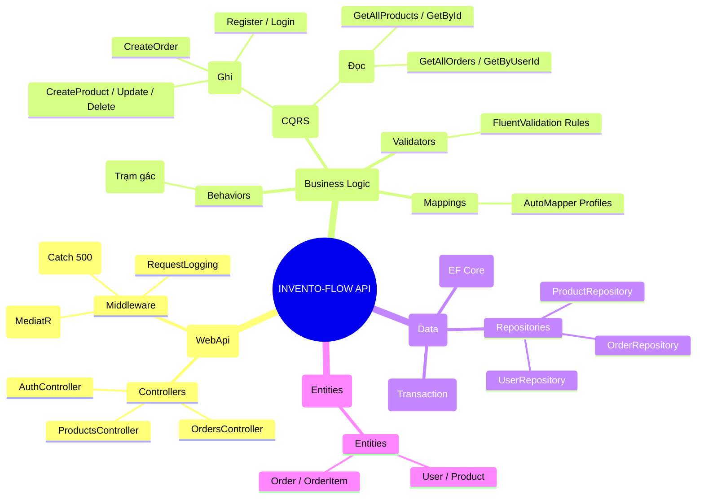
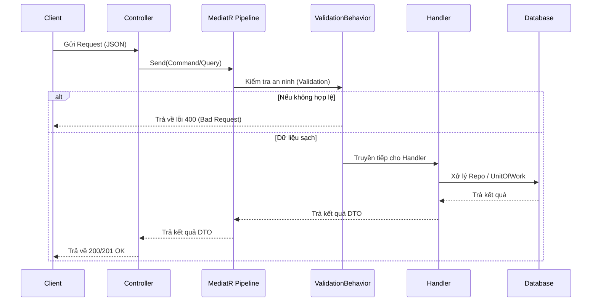

# Architecture Mindmap (INVENTO-FLOW)
Bản đồ tư duy về luồng dữ liệu và cấu trúc dự án.

```mermaid
mindmap
  root((INVENTO-FLOW API))
    Tầng 4: Presentation (WebApi)
      Controllers
        ProductsController
        OrdersController
        AuthController
      Middleware
        Validation Pipeline (MediatR)
        GlobalException (Catch 500)
        RequestLogging
    Tầng 2: Application (Business Logic)
      Features (CQRS)
        Commands (Ghi)
          CreateProduct / Update / Delete
          CreateOrder
          Register / Login
        Queries (Đọc)
          GetAllProducts / GetById
          GetAllOrders / GetByUserId
      Behaviors
        ValidationBehavior (Trạm gác)
      Mappings
        AutoMapper Profiles
      Validators
        FluentValidation Rules
    Tầng 3: Infrastructure (Data)
      AppDbContext (EF Core)
      Repositories
        ProductRepository
        OrderRepository
        UserRepository
      UnitOfWork (Transaction)
    Tầng 1: Domain (Entities)
      Entities
        User / Product
        Order / OrderItem
```

### Luồng xử lý một Request (Life Cycle)

```mermaid
sequenceDiagram
    participant User as Client
    participant Ctrl as Controller
    participant Med as MediatR Pipeline
    participant Pipe as ValidationBehavior
    participant Hand as Handler
    participant DB as Database

    User->>Ctrl: Gửi Request (JSON)
    Ctrl->>Med: Send(Command/Query)
    Med->>Pipe: Kiểm tra an ninh (Validation)
    alt Nếu không hợp lệ
        Pipe-->>User: Trả về lỗi 400 (Bad Request)
    else Dữ liệu sạch
        Pipe->>Hand: Truyền tiếp cho Handler
        Hand->>DB: Xử lý Repo / UnitOfWork
        DB-->>Hand: Trả kết quả
        Hand-->>Med: Trả kết quả DTO
        Med-->>Ctrl: Trả kết quả DTO
        Ctrl-->>User: Trả về 200/201 OK
    end
```
